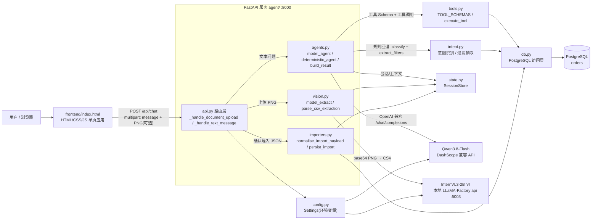
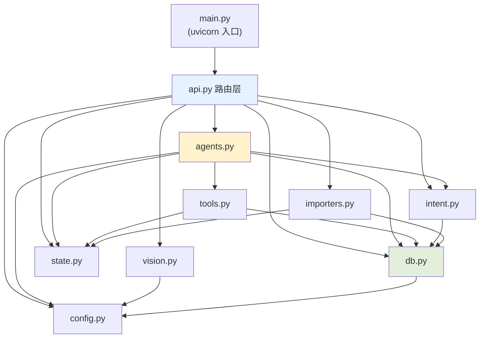
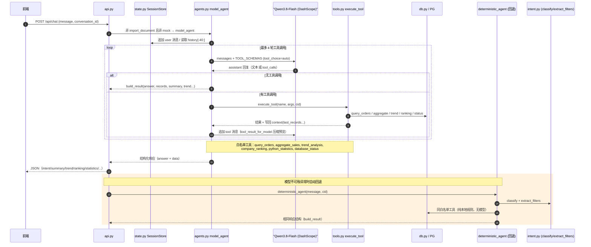
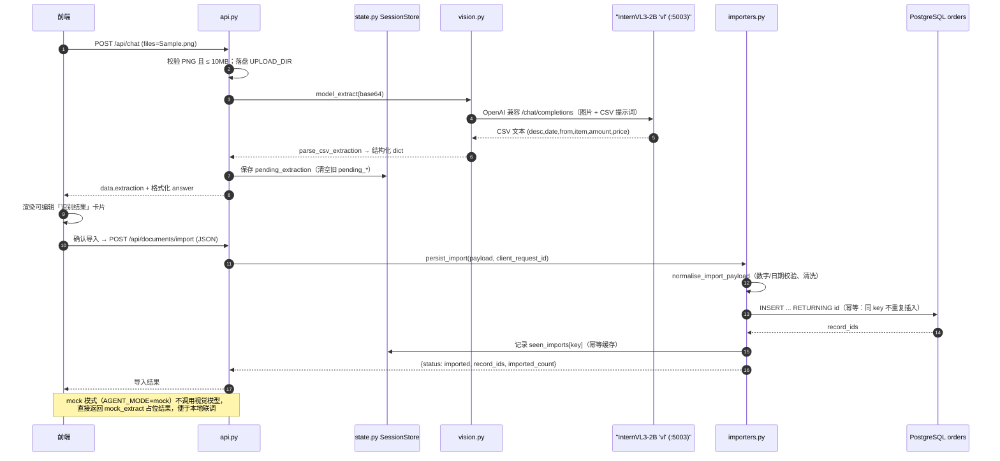
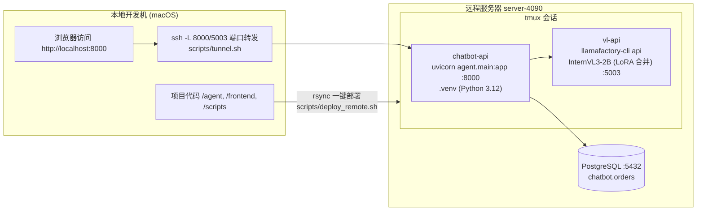

# DocuMind · Agent 系统架构

> 本文描述 `/agent` 模块化拆分后的**当前运行时架构**，配套 mermaid 图与技术栈说明。
> 代码入口：`agent/main.py` → `agent/api.py`（路由层）+ `agent/` 下功能模块。

---

## 1. 技术栈

| 层 | 技术 | 说明 |
|---|---|---|
| 前端 | 原生 HTML/CSS/JavaScript | `frontend/index.html` 单页应用，无构建步骤 |
| 后端框架 | Python 3.12 · FastAPI · Uvicorn | 服务入口 `uvicorn agent.main:app`，端口 **8000** |
| HTTP 客户端 | httpx（Async） | 调用 DashScope 与本地视觉模型 OpenAI 兼容 API |
| 数据库 | PostgreSQL · psycopg3 | 库 `chatbot`，表 `orders` |
| 文本/Agent 模型 | Qwen3.8-Flash（DashScope 兼容 API） | `MODEL_BASE_URL` + `MODEL_API_KEY` / `DASHSCOPE_API_KEY` |
| 视觉模型 | InternVL3-2B（LLaMA-Factory LoRA 微调） | 本地部署为 OpenAI 兼容 API `vl`，端口 **5003**；SFT 输出固定 CSV 格式 |
| 状态管理 | 进程内 `SessionStore`（`state.py`） | 会话历史 / 工具上下文 / 导入幂等；单 worker 部署 |
| 部署 | SSH + rsync · tmux · conda(team3) / uv | `scripts/deploy_remote.sh` / `manage.sh` / `tunnel.sh` |

> 远程目录：`/workspace/team3/chatbot`；模型权重：`/workspace/team3/models/my_best_model`；
> tmux 会话：`chatbot-api`(:8000)、`vl-api`(:5003)；日志：`/workspace/team3/logs/`。

---

## 2. 系统总览

---

## 3. agent 包模块依赖

依赖方向自顶向下、无循环：路由层只做装配，业务逻辑按「意图 → 工具 → 数据」分层。

---

## 4. 文本问答（Function Tools 编排）

---

## 5. 单据识别 → 确认导入

---

## 6. 远程部署拓扑（server-4090）

---

## 7. 关键接口与数据结构

### 7.1 HTTP 接口（FastAPI :8000）

| 接口 | 方法 | 说明 |
|---|---|---|
| `/` | GET | 返回前端单页 `frontend/index.html` |
| `/health` | GET | 健康检查（agent / database / model 状态） |
| `/api/chat` | POST | multipart：`message` + 可选 `files`(PNG) + `conversation_id` + `client_request_id` |
| `/api/documents/import` | POST | JSON：`image_name, customer_company, order_date, source_company, items[], client_request_id` |

### 7.2 Agent 工具（白名单，模型不可直接执行 SQL）

| 工具 | 用途 | 实现 |
|---|---|---|
| `query_orders` | 按客户/年份查询订单明细 + 汇总 | `db.query_orders_dataset` |
| `aggregate_sales` | 条数 / 销售数量 / 销售金额聚合 | `db.aggregate_sales_tool` |
| `trend_analysis` | 年度销量/金额趋势 | `db.trend_tool` |
| `company_ranking` | 按客户公司排名（交易额/销量，前 N） | `db.company_ranking_tool` |
| `python_statistics` | 最高/最低/平均/前后 5 名（Python 统计） | `tools.python_statistics_tool` |
| `database_status` | 连接 / 表 / 记录数 / 客户数 / 日期范围 | `db.database_status_tool` |

### 7.3 `orders` 表结构

| 列 | 类型 | 说明 |
|---|---|---|
| `id` | SERIAL PK | 主键 |
| `image_name` | TEXT NOT NULL | 来源单据文件名 |
| `customer_company` | TEXT | 顾客公司（买方） |
| `order_date` | DATE | 发注日（YYYY-MM-DD） |
| `source_company` | TEXT | 源公司（卖方） |
| `project` | TEXT | 项目/商品名 |
| `quantity` | DOUBLE PRECISION | 数量 |
| `unit_price` | DOUBLE PRECISION | 单价 |
| `total_amount` | DOUBLE PRECISION | 金额（导入时按 数量×单价 计算） |
| `created_at` | TIMESTAMPTZ | 入库时间 |

### 7.4 关键环境变量（见 `.env.example`）

`MODEL_BASE_URL` / `MODEL_NAME`(qwen3.8-flash) / `MODEL_API_KEY`·`DASHSCOPE_API_KEY` /
`VISION_MODEL_BASE_URL`(http://127.0.0.1:5003/v1) / `VISION_MODEL_NAME`(vl) /
`MODEL_TIMEOUT_SECONDS` / `MODEL_ENABLE_THINKING` / `AGENT_MODE`(auto|mock) /
`DATABASE_URL` / `UPLOAD_DIR` / `MAX_UPLOAD_SIZE_MB` / `ALLOW_ORIGINS` / `CHATBOT_HOST` / `CHATBOT_PORT`
